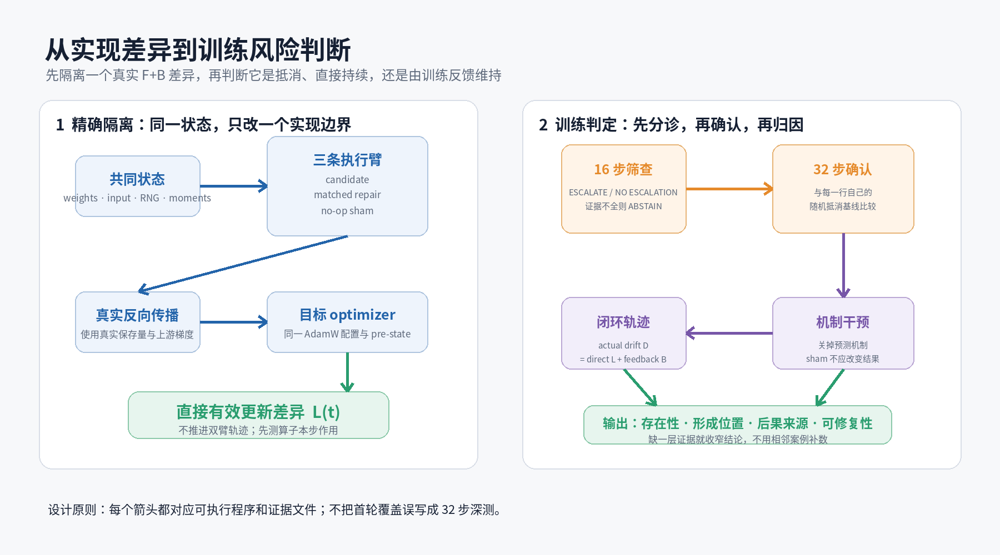
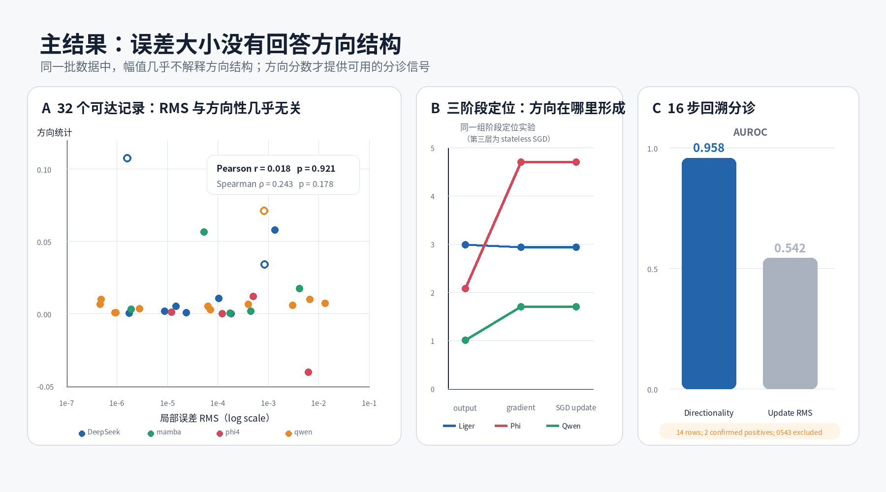
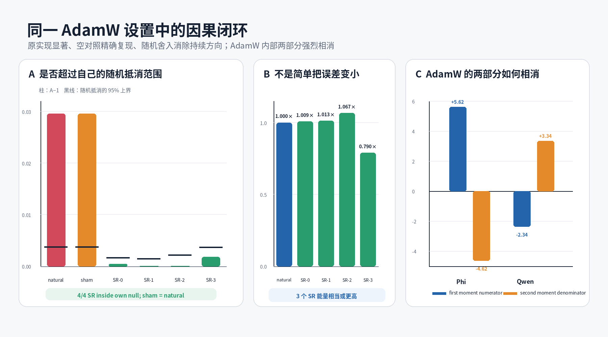

# 超越 Tolerance

## 面向 LLM 训练算子的语义级 Test Oracle

**建议时长：**18–20 分钟

**实验版本：**`547509d`

**讲稿与图片版本：**当前提交

> 核心问题：当两个实现都通过普通数值检查时，怎样判断哪个差异会被训练过程持续写入参数？

---

# Slide 1｜问题不是“有没有误差”，而是“训练会不会记住”

传统浮点测试比较 candidate 与 reference：

```text
absolute error < atol
relative error < rtol
```

这回答：**一次执行中，两者离得多远？**

LLM 训练还需要回答：

> 这些差异经过 backward 和 optimizer 后，会正负抵消，还是会持续进入参数？

一个大但随机的误差可能很快抵消；一个更小但持续同向的误差可能被训练反复写入。

今天的主张很窄：

> 我们需要一个训练语义层的 Test Oracle，补充而不是替代普通 tolerance。

**讲者提示**

开场不要报覆盖数字。先让听众接受“距离”和“方向”是两个不同问题。

---

# Slide 2｜为什么训练和一次函数调用不同

一个局部实现差异要真正改变参数，需要穿过：

```text
算子输出差异
      ↓
真实 backward
      ↓
参数 gradient 差异
      ↓
AdamW 等 optimizer
      ↓
实际参数 update 差异
      ↓
下一步的参数与 optimizer 状态改变
```

因此只比较 forward output 会遗漏三件事：

1. backward 可能把原本接近抵消的差异变成有方向的 gradient；
2. optimizer 也可能再次放大或抵消这个方向；
3. 两条训练轨迹分开后，后续反馈可能远大于算子本步作用。

> 训练是一个有状态循环，不是一次纯函数调用。

---

# Slide 3｜现有工作解决了什么，还缺什么

FlashAttention 原论文用一张图回答“为什么 tiling 能减少 HBM 访问”，再用 runtime 与 memory 曲线证明收益。它的核心是 **IO-aware**，不是数值安全 Oracle。

Meta/Harvard 的 *Is Flash Attention Stable?* 做了两件重要的事：

1. 用可控的小实验研究精度、序列长度和分块方式怎样影响数值差异；
2. 比较训练权重与输出分布，把 Flash Attention 的数值差异放到随机初始化和低精度训练的尺度中理解。

它表明“误差需要放到训练中理解”，但它主要从孤立 forward deviation 推断或约束训练影响。

我们补的问题是：

> 能否在一个精确算子边界上，用 actual backward、目标 optimizer 和 matched repair，直接测量差异是否持续进入参数？

参考：

- [FlashAttention](https://arxiv.org/abs/2205.14135)
- [Is Flash Attention Stable?](https://arxiv.org/abs/2405.02803)

---

# Slide 4｜Cancellation Preservation Property

考虑大小相同、方向相反的两个实现误差：

```text
+ε   与   −ε
```

如果：

1. 正负误差事件及其与 input、gradient、reduction 位置的配对保持平衡；
2. actual backward 与 optimizer 对 `+ε`、`−ε` 的响应仍互为相反数；

那么它们长期应当抵消。

抵消只会从两个入口被破坏：

- **误差事件或配对不平衡**：某一侧出现更多，或总与某类训练条件配对；
- **训练响应不对称**：相反的误差没有产生相反的参数 update。

我们将其称为 **Cancellation Preservation**：

> 安全不要求误差为零；它要求正负误差经过完整训练路径后仍保持可抵消。

这是条件化的 property。它依赖实现、operand、backward、optimizer 和当前状态，不是只看 kernel 名字的静态定律。

---

# Slide 5｜从 Property 到可执行 Screen



左半部分隔离目标差异：

- 原实现、只修目标边界的对照和“不做任何修改”的空对照从同一状态执行；
- 走同一个 actual backward；
- 使用同一 optimizer pre-state；
- 得到目标算子本步直接造成的有效 update difference `L(t)`。

右半部分逐级增加证据：

```text
16 步筛查
→ 32 步与自身随机抵消基线确认
→ direct / feedback / actual 分解
→ matched causal intervention
```

证据缺失时输出 `ABSTAIN`，不用相近案例补数字。

**讲者提示**

这一页只解释方法。不要同时讲 1,562、AUROC 或 Phi 结果。

---

# Slide 6｜分母：我们到底检查了多少训练程序

冻结范围包含四个核心模型、三个 sequence length，共 12 个模型–长度单元。

| 层级 | 数量 | 它表示什么 |
|---|---:|---|
| 训练执行中记录到的调用 | 466,419 | 实际训练步的调用规模 |
| 被测编译实现调用 | 70,171 | candidate implementation 的执行实例 |
| 绑定 actual forward/backward 的数学单元 | 186,807 | 训练语义关系已闭合 |
| 完成首轮数值处置的具体输出位置 | 1,562 / 1,562 | 冻结分母中无静默缺项 |

但 `1,562` 不等于 `1,562` 条 32 步训练轨迹。

进入深测还需要：

- 非零且能够进入反向传播的差异；
- 参数可达；
- exact repair 与 sham；
- 完整状态与 optimizer 数据。

> “全量覆盖”保证没有静默丢掉位置；“深度案例”负责提供昂贵的因果证据。两者不能混写。

---

# Slide 7｜主结果：误差大小没有回答方向结构



这张图集中回答三个问题。

### A. 误差 RMS 能预测方向性吗？

不能。在 32 个差异能够进入反向传播并到达参数的记录中：

- Pearson `r=0.018`，`p=0.921`；
- Spearman `ρ=0.243`，`p=0.178`。

当前样本中，误差幅值几乎不解释方向结构。

### B. 方向性在哪里形成？

- Liger：算子输出阶段已经形成，backward 基本保持；
- Phi：backward 将方向性从 `2.074` 放大到 `4.701`；
- Qwen companion：output 约 `1.008`，到 gradient 后为 `1.698`。

这一面板使用 stateless SGD，只负责定位形成阶段，不负责 AdamW verdict。

### C. 16 步方向分数比同层 RMS 更会排序吗？

在排除未决候选 `0543` 的 14 行 confirmed-only 回溯集合中：

- directionality AUROC `0.958`；
- update RMS AUROC `0.542`。

这是只有 2 个 confirmed positives 的小样本回溯结果，不是 95.8% 的通用准确率。

---

# Slide 8｜同一个案例，optimizer 可以改变 verdict

早期数据使用不同 optimizer，不能公平比较。我们撤回旧 accuracy，并统一到 cold-start AdamW：

```text
moments 从零初始化，随后正常演化
lr = 1e-4
β1 = 0.9, β2 = 0.95, ε = 1e-8
同一 16/32 步规则
```

统一后：

| Case | AdamW direct A32 | 结论 |
|---|---:|---|
| Liger fused CE | 约 1.71 | confirmed direct persistence |
| Phi `lm_head dX` | 1.02959 | 小但显著；自身 null 95% 上界 1.00376 |
| Qwen seq128 `lm_head dX` | 约 0.96 | direct effect 抵消 |
| Phi 0543 | 1.014 | 未通过 discovery family 的 Holm 校正，保持未决 |

Qwen 是最直观的提醒：

```text
gradient 有方向
≠
AdamW update 仍有方向
```

> Optimizer configuration 和 moment state 是测试输入，不是报告末尾的附注。

---

# Slide 9｜主结果：同一 AdamW 协议中的因果闭环



### A. 方向性是否真实存在？

- deterministic BF16：`A=1.02959`，高于自身 null `1.00376`；
- no-op sham：精确复现 natural；
- 四个 stochastic-rounding 重复：`1.00045、1.00004、1.00005、1.00182`，全部处于各自 null 内。

### B. 是否只是误差变小？

前三个 SR 重复的路径能量是 natural 的：

```text
1.009×   1.013×   1.067×
```

方向持续性仍全部消失。第四个能量为 `0.790×`，单列，不用它支撑能量匹配论点。

### C. AdamW 内部如何改变结果？

对同一更新公式做精确对称分解，沿最终方向的 signed shares 为：

| Case | first-moment numerator | second-moment denominator |
|---|---:|---:|
| Phi | +5.62 | −4.62 |
| Qwen | −2.34 | +3.34 |

两项相加精确为 1；它们是加性归因，不是两次独立实验的 effect size。

> 这一页闭合“发现 direct persistence → sham 排除测量扰动 → source intervention 消除 persistence → optimizer 内部归因”。

---

# Slide 10｜最终轨迹：更远不等于更有方向，方向也不等于 direct

在同一个 Phi final-norm 单载体受控实验中：

| 实验臂 | 32 步参数距离 | actual A | 读法 |
|---|---:|---:|---|
| operator candidate vs repair | 9.186×10⁻⁵ | 4.488 | 距离较小，但高度同向 |
| BF16 vs FP32 F+B | 3.223×10⁻⁴ | 1.857 | 距离更大，但方向更分散 |
| 同一批数据换顺序 | 3.548×10⁻⁵ | 0.0067 | 完整 batch multiset 用完后几乎抵消 |
| RNG seed | 0 | 不适用 | 该设置没有 dropout |

这不是全参数训练，而是同一个预先指定参数位置上的尺度对照。它说明：

> 只看最终距离会把“走得远”和“持续朝同一方向走”混在一起。

但 actual trajectory 有方向，也不能全部归给目标算子本步。

两条训练轨迹分开后：

\[
D(t+1)-D(t)=L(t)+B(t).
\]

- `L(t)`：同一状态下，目标实现本步直接造成的 update difference；
- `B(t)`：参数和 optimizer state 已分叉后产生的反馈；
- `D(t)`：实际 parameter separation。

沿最终实际分离方向的带符号贡献：

| Case | direct | feedback | 解释 |
|---|---:|---:|---|
| Liger | 0.46% | 99.54% | 小 direct trigger，反馈随后放大 |
| Phi | 43.93% | 56.07% | 两部分都重要 |
| Qwen | −8.62% | 108.62% | direct 与最终方向相反，feedback 主导 |

因此：

> 最终权重变了，不能直接推出目标算子本步存在 persistent bias。

---

# Slide 11｜这个 Screen 实际怎样用

正式输出：

```text
ESCALATE
NO_ESCALATION_UNDER_SHORT_SCREEN
ABSTAIN
```

在名义 15 行回溯视图中：

- 16 步规则升级 5 行；
- 包含 2 个 confirmed positives；
- 包含 1 个后来保持未决的 `0543`；
- 另有 2 个 controls 被升级。

另外，12 个结果盲机械抽样 controls 的完整轨迹中，11 个主要由 feedback 维持最终分离，1 个是 direct 与 feedback 混合。这是为什么 screen 必须测 direct effect，而不能只看最终权重距离。

排除 `0543` 后的 14 行 confirmed-only 视图：

- directionality AUROC `0.958`，bootstrap 95% 区间 `[0.833, 1.000]`；
- 2 个 positives 与 12 个 negatives 之间只有 1 个 pair 排序错误。

但短筛没有升级仍不等于安全。

> 工程价值是高召回地缩小昂贵确认范围；不是用 16 步替代 32 步证据。

---

# Slide 12｜贡献：不是新 tolerance，而是新测试对象

### 1. 新的 correctness target

从 numerical closeness 转向：实现差异是否形成持续有效 update。

### 2. Cancellation Preservation Property

安全的关键不是零误差，而是正负差异经过真实训练路径后仍可抵消。

### 3. 新的测试单元

```text
exact forward + actual backward + target optimizer + matched repair
```

### 4. 新的归因方式

区分 direct、feedback 与 actual separation，避免把闭环放大全部归给算子。

### 5. 可执行、fail-closed 的工作流

```text
全量 F+B census
→ 16-step screen
→ 32-step confirmation
→ causal intervention
→ ABSTAIN on missing evidence
```

---

# Slide 13｜当前边界

目前没有证明：

- 对所有模型、optimizer 和实现类都通用；
- 16 步不升级就代表安全；
- 当前 positive 会导致完整训练崩溃；
- 单参数或声明参数块等价于全参数训练；
- 只看 kernel 代码即可静态预测；
- 未见 implementation 上的 source-positive recall 已得到验证。

Phi 新干预闭合的是：

> 同一状态下，目标实现对 direct effective update 的 source mechanism。

它不是 stochastic-rounding candidate 与 repair 的完整闭环训练轨迹。

这些边界定义当前结论的适用范围，不否定现有因果结果。

---

# Slide 14｜结论

第一：

> Tolerance 告诉我们两个浮点结果离多远，但不能告诉我们训练是否长期记住这个差异。

第二：

> Cancellation Preservation 检查正负实现误差经过 actual backward 和 optimizer 后是否仍可抵消。

第三：

> Direct Persistence Screen 将它变成可执行、fail-closed 的分诊流程，并在同一 AdamW 协议下完成 natural positive、no-op sham 和 causal stochastic-rounding intervention。

最终交付不是另一个 tolerance，而是一种新的软件测试 Oracle：

> **当两个实现都通过传统数值检查时，它帮助我们判断哪个差异会被训练过程持续写入参数。**

---

# Backup 1｜方向分数

对逐步 update difference `x(1)…x(T)`：

\[
A=\frac{\lVert\sum_t x(t)\rVert}{\sqrt{\sum_t\lVert x(t)\rVert^2}}.
\]

- 每步方向随机：`A` 接近自己的 sign-flip null；
- 多步方向一致：`A` 高于自己的 null；
- 32 步理论最大值：`√32≈5.66`。

正式确认不用一个全局固定阈值，而是使用每一行自己的随机抵消基线。

---

# Backup 2｜Phi 同协议干预原始数字

| Arm | A32 | null 95% | one-sided p | path energy / natural |
|---|---:|---:|---:|---:|
| deterministic BF16 | 1.029595 | 1.003761 | 0.000250 | 1.000 |
| no-op sham | 1.029595 | 1.003754 | 0.000250 | 1.000 |
| SR-0 | 1.000450 | 1.001673 | 0.341 | 1.009 |
| SR-1 | 1.000038 | 1.001475 | 0.482 | 1.013 |
| SR-2 | 1.000051 | 1.002199 | 0.494 | 1.067 |
| SR-3 | 1.001819 | 1.003706 | 0.376 | 0.790 |

---

# Backup 3｜证据索引

- Coverage：`docs/coverage_table_v1.md`
- 当前主线：`docs/current_mainline.md`
- 32 行 RMS 分析：`results/property/joint_bias_formation_v1/rms_persistence/rms_persistence.json`
- Screen：`results/property/direct_persistence_v4/retrospective_metrics.json`
- 多重比较：`results/property/direct_persistence_v4/multiplicity.json`
- Direct/feedback：`results/property/direct_persistence_v4/contribution_table.json`
- AdamW 分解：`results/property/direct_persistence_v4/optimizer_state/*_adamw_response_components.json`
- Phi 干预：`results/property/direct_persistence_v4/interventions/phi_seq64_adamw_sr32.json`
- 完整性审计：`results/property/direct_persistence_v4/completion_audit.json`
