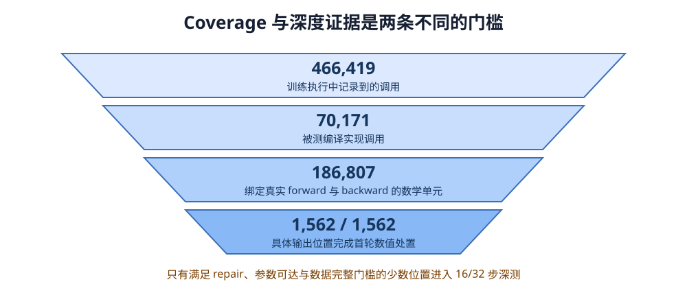
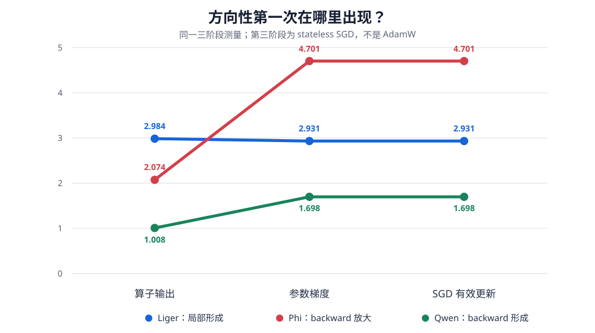
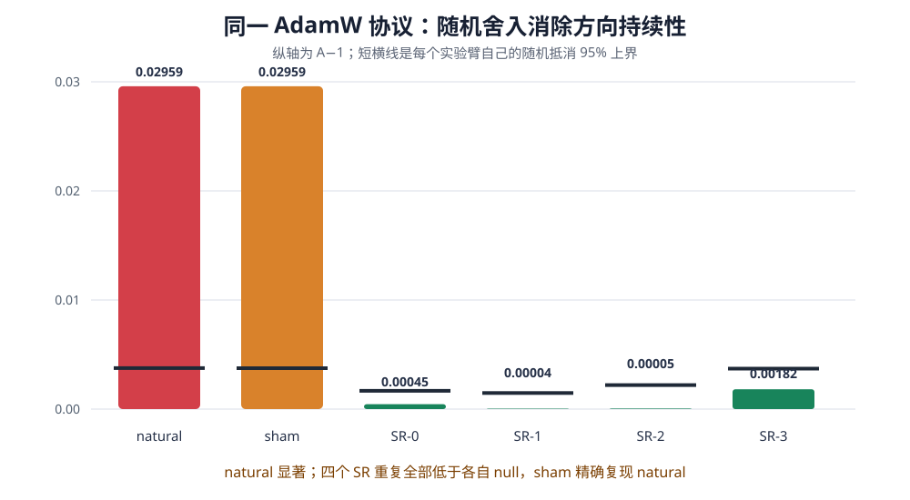

# 超越 Tolerance

## 面向 LLM 训练算子的语义级测试 Oracle

**建议时长：**18–20 分钟  
**听众：**软件工程、编译器、系统、测试与可靠性研究者  
**实验版本：**`547509d`（`agent/bias-property-tournament`）

> 核心问题：当两个实现都通过普通误差检查时，怎样判断哪个差异会被训练过程持续写入参数？

---

# Slide 1｜这是一个 Test Oracle 问题

传统浮点测试通常比较 candidate 和 reference：

```text
absolute error < atol
relative error < rtol
```

它回答的是：**一次执行中，两个结果离得多远？**

训练系统还需要回答另一个问题：

> 这些误差经过多次执行，会正负抵消，还是会持续进入模型参数？

我们的工作不是再设计一个 tolerance，而是补上这个训练语义层的 Oracle。

**本页要带走的数据**

- 在 32 个 backward-visible、parameter-reachable 记录中，局部误差 RMS 与方向性的 Pearson `r=0.018`、`p=0.921`。
- 在冻结的回溯集合中，16 步方向分数 AUROC 为 `0.944`，同层 update RMS 只有 `0.528`。

> 讲者提示：第一分钟只建立“距离”和“方向”不是一回事，不要先讲复杂数学。

---

# Slide 2｜一分钟理解 LLM 训练

不熟悉大模型训练，只需要知道四步：

```text
forward → loss → backward → optimizer update
```

一个局部实现差异要改变参数，需要穿过：

```text
算子输出差异
  ↓
真实 backward
  ↓
参数 gradient 差异
  ↓
AdamW 等 optimizer
  ↓
实际参数 update 差异
  ↓
下一步的参数和 optimizer 状态改变
```

AdamW 还保存历史平均值，并按坐标缩放 gradient。因此 gradient 有方向，不代表真正写入参数的 update 仍有方向。

**本页证据**

- Phi 同一批 gradient 的 stateless-SGD 方向性为约 `4.70`。
- 换成真实 cold-start AdamW 后，只剩约 `1.03`。

> 讲者提示：训练是一个有状态循环，不是一次纯函数调用。这是后面所有设计的原因。

---

# Slide 3｜Flash Attention 暴露了 Oracle 盲区

Flash Attention 与标准 attention 在实数数学上等价，但改变了：

- 分块和归约顺序；
- 中间结果何时保存；
- 低精度舍入发生的位置。

在特定训练条件下，多个同号贡献会在 BF16 中按固定顺序累加，小增量反复落入相同舍入区间。单步误差很小，但可能不抵消。

```text
小误差 + 持续同向
可能比
大误差 + 正负抵消
更值得检查
```

Flash Attention 给出的启发不是“BF16 一定不安全”，而是：

> Tensor-level tolerance 没有直接测量真实训练路径是否保留误差抵消。

**边界**

这里引用的是一种已知机制，不声称所有 Flash Attention、模型或训练设置都会失稳。

---

# Slide 4｜Cancellation Preservation Property

我们使用的组织性质叫 **Cancellation Preservation**，中文可称“抵消保持”。

考虑大小相同、方向相反的两个实现误差：

```text
+ε   与   −ε
```

如果完整训练路径仍满足：

1. 正负误差事件及其与输入、gradient 的配对保持平衡；
2. backward 和 optimizer 对 `+ε`、`−ε` 的响应仍互为相反数；

那么它们长期会抵消。

抵消被破坏只有两个基本入口：

- **误差事件或配对不平衡**：一侧出现更多，或总与某类 reduction 位置、input、gradient 配对；
- **训练响应不对称**：严格相反的误差没有产生相反的参数 update。

> Property 不是要求误差为零，而是要求正负误差经过真实训练路径后仍能抵消。

**适用边界**

这是一个条件化的训练性质：结论依赖实现、operand、backward、optimizer 和当前状态，不是只看 kernel 名字的静态定律。

---

# Slide 5｜Property 怎样变成可执行 Screen

工具名：**Direct Persistence Screen**。

它检查：在目标 optimizer 下，candidate 与 matched repair 从相同状态出发时，目标算子本步造成的有效参数 update 差异，是抵消还是持续累积？

每次比较固定：

- 同一模型参数；
- 同一输入和数据顺序；
- 同一 optimizer moments；
- 同一随机状态；
- 只替换一个精确实现边界。

输出只有：

```text
ESCALATE
NO_ESCALATION_UNDER_SHORT_SCREEN
ABSTAIN
```

短筛没有升级，不等于证明安全。无法闭合 repair、参数坐标或状态时直接 `ABSTAIN`。

> 讲者提示：这是一套把昂贵确认留给少数候选的流程，不是“一键安全认证”。

---

# Slide 6｜测试单元不是抽象的 `mm`

同一个 `mm` 名字可能对应：

- 不同模型层；
- 不同生成 kernel；
- 不同 saved tensors；
- 不同 backward；
- 不同参数到达路径。

因此测试单元是：

> 一个具体 forward invocation，加上真正消费其 saved state 和 upstream gradient 的 actual backward program。

我们绑定：

```text
exact forward endpoint
+ saved tensors
+ actual backward edge
+ reachable parameter coordinates
+ candidate / repair / sham
+ optimizer configuration
```

普通 differential testing 比较两次 output；这里比较一个具体实现差异经过真实训练程序后的参数 update。

---

# Slide 7｜Coverage 与深度证据是两条泳道



冻结范围覆盖四个核心模型、三个序列长度，共 12 个模型–长度单元：

- `466,419` 次训练执行调用；
- `70,171` 次被测编译实现调用；
- `186,807` 个绑定真实 forward/backward 的数学单元；
- `1,562/1,562` 个具体输出位置完成首轮数值处置。

这不等于 1,562 条 32 步轨迹。只有通过 repair、参数可达和数据完整门槛的位置进入深测。

> 正确口径：全量 census 防止静默漏项；少量 deep cases 提供因果与轨迹证据。

---

# Slide 8｜方向分数：随机游走还是持续推动

对一组逐步 update difference `x₁…x_T`，我们计算：

\[
A=\frac{\lVert\sum_t x_t\rVert}{\sqrt{\sum_t\lVert x_t\rVert^2}}.
\]

直觉上：

- 每步方向随机时，累计位移接近随机游走尺度，`A≈1`；
- 多步方向一致时，`A` 明显大于自身随机基线；
- 32 步的理论最大值是 `√32≈5.66`。

不能用全项目统一的“`A>1` 就有问题”作为科学判据。正式确认要用每一行自己的 sign-flip null。

```text
前 16 步：便宜分诊
      ↓
升级项跑 32 步并与自身 null 比较
```

**一个量、两个用途**

- `A16`：工程分诊；
- `A32 + self-null`：确认直接持续作用。

---

# Slide 9｜先定位方向性在哪里形成



这张图使用统一的三阶段 companion measurement，第三阶段是 **stateless SGD**：

| Case | 算子输出 A | 参数 gradient A | SGD update A | 解释 |
|---|---:|---:|---:|---|
| Liger fused CE | 2.984 | 2.931 | 2.931 | 局部已经形成，backward 基本保持 |
| Phi `lm_head dX` | 2.074 | 4.701 | 4.701 | backward 明显放大方向性 |
| Qwen `lm_head dX` companion | 1.008 | 1.698 | 1.698 | 局部近扩散，方向主要在 backward 后出现 |

这回答“在哪里形成”，但不能直接替代 AdamW verdict。

> 讲者提示：图中的 Qwen 是 seq256 companion；后面的 strict AdamW live case 是 seq128。称为同一数学 family，不称同一 exact invocation。

---

# Slide 10｜统一 AdamW 后，案例身份改变了

早期 positive 与 controls 使用了不同 optimizer，不能公平比较。我们撤回旧准确率，并统一使用：

- cold-start AdamW；
- moments 从零初始化，之后正常演化；
- `lr=1e-4`、`β₁=0.9`、`β₂=0.95`、`ε=1e-8`；
- 同一 16/32 步规则。

统一后：

- **Liger**：确认直接持续，`A32≈1.71`；
- **Phi**：小但显著，`A32=1.02959`，自身 null 上界 `1.00376`；
- **Qwen seq128**：`A32≈0.96`，不属于 AdamW direct positive；
- **Phi 0543**：单行 nominal `p≈0.026`，未通过 12 行 discovery family 的 Holm 校正，保持未决。

> 执行环境是 Oracle 定义的一部分。不能把 SGD 的 positive 和 AdamW 的 negative 混成一张准确率表。

---

# Slide 11｜同一 AdamW 协议下的因果干预



同一 32 个状态、参数位置、state order、actual backward 和 AdamW 状态：

| Arm | A32 | 自身 null 95% 上界 | 结果 |
|---|---:|---:|---|
| deterministic BF16 | 1.02959 | 1.00376 | 直接持续 |
| no-op sham | 1.02959 | 1.00375 | 精确复现 natural |
| SR seed 0 | 1.00045 | 1.00167 | 未检测到持续 |
| SR seed 1 | 1.00004 | 1.00147 | 未检测到持续 |
| SR seed 2 | 1.00005 | 1.00220 | 未检测到持续 |
| SR seed 3 | 1.00182 | 1.00371 | 未检测到持续 |

前三个 SR 重复的路径能量分别是 natural 的 `1.009×、1.013×、1.067×`，方向持续性仍全部消失。第四个为 `0.790×`，单独保留，不用它支撑能量匹配论点。

> 最可靠结论：误差仍存在且前三个重复没有变小，但不再连续朝同一方向累积。

---

# Slide 12｜AdamW 不是简单缩放器

我们用同一批已捕获 gradient 和 moments，将 AdamW update difference 精确拆成：

- first-moment numerator response；
- second-moment denominator response。

沿最终 update difference 方向的 signed attribution shares：

| Case | numerator | denominator | 相加 |
|---|---:|---:|---:|
| Phi | +5.62 | −4.62 | 1.00 |
| Qwen | −2.34 | +3.34 | 1.00 |

最大数值重构误差：

- Phi：`2.71×10⁻²⁰`；
- Qwen：`6.62×10⁻²⁴`。

这些 share 是同一更新公式的精确加性归因，不是两个独立实验的 effect size。它们可以大于 1 或为负，因为两项会互相抵消。

> AdamW 的影响依赖 gradient 与 moment state：它既不是统一根因，也不是可忽略的最后一步。

---

# Slide 13｜Direct effect 与最终分离必须拆开

两条轨迹分开后，后续差异来自两部分：

\[
D_{t+1}-D_t=L_t+B_t,
\]

- `L_t`：同一状态下目标实现本步直接造成的 update difference；
- `B_t`：参数和 optimizer state 已分叉后产生的反馈；
- `D_t`：实际 parameter separation。

32 步贡献表显示：

| Case | direct 沿最终方向占比 | feedback 占比 | 解释 |
|---|---:|---:|---|
| Liger | 0.46% | 99.54% | 小 direct trigger，后续反馈更大 |
| Phi | 43.93% | 56.07% | 两部分都重要 |
| Qwen | −8.62% | 108.62% | direct 与最终方向相反，feedback 主导 |

这些是沿最终方向的带符号投影，不是简单 norm 比例。

此外，12 个结果盲机械抽样 controls 中，11 个是 feedback-sustained，1 个是 mixed。这证明“最后权重分开”不能直接当作算子本步 bias 的证据。

---

# Slide 14｜短程 Screen 的实际能力

统一 cold-start AdamW 的回溯集合有两种诚实口径：

### 名义发现视图：15 行

- 3 个名义 positives，其中 `0543` 尚未通过多重比较；
- 12 个 negatives；
- directionality AUROC `0.944`，bootstrap 95% 区间 `[0.778, 1.000]`；
- update RMS AUROC `0.528`；
- 16 步规则升级 5 行：3 个名义 positives + 2 个 controls。

### 确认视图：14 个已解决记录

- 2 个 confirmed positives；
- 12 个 negatives；
- `0543` 从分母排除，不改标 negative；
- directionality AUROC `0.958`，95% 区间 `[0.833, 1.000]`；
- 只发生 1 个 positive-negative pair 错排。

> 这是小样本回溯排序能力，不是 94.4% 的通用准确率，也不是未见实现 recall。

---

# Slide 15｜核心贡献

### 1. 新的 correctness target

从“数值距离多大”转向“实现差异是否形成持续有效 update”。

### 2. Cancellation Preservation Property

安全的关键不是零误差，而是正负误差经过真实训练路径后仍可抵消。

### 3. 新的测试单元

```text
exact forward + actual backward + target optimizer + matched repair
```

### 4. 新的归因方式

明确分开 direct、feedback 和 actual separation，避免把闭环放大错误归给算子本步。

### 5. 可执行、fail-closed 的工作流

```text
全量 F+B census
→ 16-step screen
→ 32-step confirmation
→ causal intervention
→ ABSTAIN on missing evidence
```

---

# Slide 16｜怎样进入 kernel CI

当 kernel library、compiler 或 GPU backend 更新时：

```text
定位实现发生变化的具体 F+B units
          ↓
运行 16-step Direct Persistence Screen
          ↓
仅升级少数候选
          ↓
matched repair + 32-step confirmation
          ↓
区分 kernel direct effect、optimizer response 和 feedback
```

它可以发现：

- output error 很小，但会持续进入参数的实现；
- output error 较大，但会在真实训练路径中抵消的实现。

当前工具价值是**决定哪些差异值得昂贵检查或修复**，不是自动输出一张“坏算子名单”。

---

# Slide 17｜当前边界

目前没有证明：

- 对所有模型、optimizer 和实现类都通用；
- 16 步不升级就代表安全；
- 当前 positive 会导致完整训练崩溃；
- 单参数或声明参数块等价于全参数训练；
- 只看 kernel 代码即可静态预测；
- 未见 implementation 上的 source-positive recall 已得到验证。

Phi 新干预闭合的是：

> 同一状态下，目标实现对 direct effective update 的 source mechanism。

它不是 stochastic-rounding candidate 与 repair 的完整闭环训练轨迹。

这些边界定义了当前结论的适用域，不应被隐藏，也不否定现有因果结果。

---

# Slide 18｜结论

第一：

> Tolerance 告诉我们两个浮点结果离多远，但不能告诉我们训练是否长期记住这个差异。

第二：

> Cancellation Preservation 检查正负实现误差经过真实 backward 和 optimizer 后是否仍可抵消。

第三：

> Direct Persistence Screen 将它变成可执行、fail-closed 的分诊流程，并在同一 AdamW 协议下完成 natural positive、no-op sham 和 causal stochastic-rounding intervention。

最终交付不是另一个 tolerance，而是一种新的软件测试 Oracle：

> **当两个实现都通过传统数值检查时，它帮助我们判断哪个差异会被训练过程持续写入参数。**

---

# Backup 1｜Phi 同协议干预原始数字

| Arm | A32 | null median | null 95% | one-sided p | path energy / natural |
|---|---:|---:|---:|---:|---:|
| deterministic BF16 | 1.029595 | 约 1.000 | 1.003761 | 0.000250 | 1.000 |
| no-op sham | 1.029595 | 约 1.000 | 1.003754 | 0.000250 | 1.000 |
| SR-0 | 1.000450 | 约 1.000 | 1.001673 | 0.341 | 1.009 |
| SR-1 | 1.000038 | 约 1.000 | 1.001475 | 0.482 | 1.013 |
| SR-2 | 1.000051 | 约 1.000 | 1.002199 | 0.494 | 1.067 |
| SR-3 | 1.001819 | 约 1.000 | 1.003706 | 0.376 | 0.790 |

数据文件：`results/property/direct_persistence_v4/interventions/phi_seq64_adamw_sr32.json`

---

# Backup 2｜为什么 signed share 可以大于 100%

固定实际最终方向 `u_D`，报告：

\[
s_L=\frac{\langle\sum_t L_t,u_D\rangle}{\lVert\sum_tD_t\rVert},\qquad
s_B=\frac{\langle\sum_t B_t,u_D\rangle}{\lVert\sum_tD_t\rVert}.
\]

当 direct 和 feedback 互相抵消时：

- 一项可以大于 1；
- 另一项可以为负；
- 加上 recurrence residual 后总和约为 1。

因此它们是带符号的方向贡献，不是“总能量百分比”。

---

# Backup 3｜证据索引

- Coverage：`docs/coverage_table_v1.md`
- 当前主线：`docs/current_mainline.md`
- 三阶段数据：`docs/general_bias_mechanism_map.md`
- Screen 结果：`results/property/direct_persistence_v4/retrospective_metrics.json`
- 多重比较：`results/property/direct_persistence_v4/multiplicity.json`
- Direct/feedback 贡献：`results/property/direct_persistence_v4/contribution_table.json`
- AdamW 内部分解：`results/property/direct_persistence_v4/optimizer_state/*_adamw_response_components.json`
- Phi AdamW 干预：`results/property/direct_persistence_v4/interventions/phi_seq64_adamw_sr32.json`
- 完整性审计：`results/property/direct_persistence_v4/completion_audit.json`

