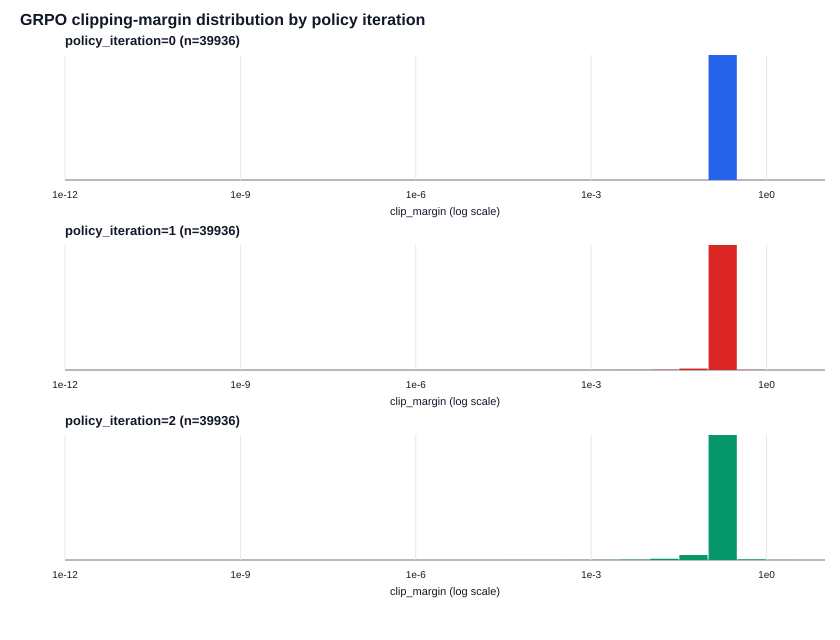

# Phase 0 Margin Histogram

## Claim Scope
Execution-path mismatch is relevant only when the training algorithm's own discrete boundary amplifies it into an optimization-semantic fork. A fork is called fragile or bug only under a validated analytic legal bound; raw numerical mismatch alone is not a claim.

## Confound Checklist
- fixed_response_tokens: N/A for margin dump
- real_old_logp_present: PASS
- real_grpo_training: PASS
- zero_advantage_excluded_as_not_applicable: PASS
- zero_advantage_rows_excluded: 33792
- deterministic_env_recorded: PASS
- warn_only_messages_recorded: PASS
- late_minibatch_gate_used: PASS

## Delta Self Control
N/A in Phase 0; delta_self is checked in Phase 1.

## Summary
GO: late-minibatch near-boundary mass is sufficient for clipping fork scan.

## Overall
| group | n | p0.1 | p1 | p5 | p50 | P(margin<0.0001) | P(margin<0.001) | P(margin<0.01) | P(margin<0.05) |
| --- | --- | --- | --- | --- | --- | --- | --- | --- | --- |
| overall | 119808 | 0.005851668608877411 | 0.05604266401562578 | 0.14752598642041947 | 0.18232346414258743 | 3.338675213675214e-05 | 0.00020032051282051281 | 0.0016192574786324787 | 0.008755675747863248 |

## Late Minibatches
| group | n | p0.1 | p1 | p5 | p50 | P(margin<0.0001) | P(margin<0.001) | P(margin<0.01) | P(margin<0.05) |
| --- | --- | --- | --- | --- | --- | --- | --- | --- | --- |
| late_policy_iteration=2 | 39936 | 0.0023687946922514346 | 0.02403738740649336 | 0.09845709769086411 | 0.18232727883985306 | 7.512019230769231e-05 | 0.0005258413461538461 | 0.004131610576923077 | 0.022010216346153848 |

## By Policy Iteration
| group | n | p0.1 | p1 | p5 | p50 | P(margin<0.0001) | P(margin<0.001) | P(margin<0.01) | P(margin<0.05) |
| --- | --- | --- | --- | --- | --- | --- | --- | --- | --- |
| policy_iteration=0 | 39936 | 0.18232155679395462 | 0.18232155679395462 | 0.18232155679395462 | 0.18232155679395462 | 0.0 | 0.0 | 0.0 | 0.0 |
| policy_iteration=1 | 39936 | 0.014537669543239954 | 0.08437662957837845 | 0.15081644891431595 | 0.18241692422559525 | 2.5040064102564102e-05 | 7.512019230769231e-05 | 0.000726161858974359 | 0.004256810897435897 |
| policy_iteration=2 | 39936 | 0.0023687946922514346 | 0.02403738740649336 | 0.09845709769086411 | 0.18232727883985306 | 7.512019230769231e-05 | 0.0005258413461538461 | 0.004131610576923077 | 0.022010216346153848 |

## By Minibatch
| group | n | p0.1 | p1 | p5 | p50 | P(margin<0.0001) | P(margin<0.001) | P(margin<0.01) | P(margin<0.05) |
| --- | --- | --- | --- | --- | --- | --- | --- | --- | --- |
| rollout=0,iteration=0 | 512 | 0.18232155679395462 | 0.18232155679395462 | 0.18232155679395462 | 0.22314355131420976 | 0.0 | 0.0 | 0.0 | 0.0 |
| rollout=0,iteration=1 | 512 | 0.004241331678216291 | 0.04580203509010847 | 0.12464434858593829 | 0.21380421873364336 | 0.0 | 0.0 | 0.00390625 | 0.01171875 |
| rollout=0,iteration=2 | 512 | 0.0029902471486880056 | 0.010333822747251586 | 0.05260770078930742 | 0.1956534296033986 | 0.0 | 0.0 | 0.01171875 | 0.046875 |
| rollout=1,iteration=0 | 512 | 0.18232155679395462 | 0.18232155679395462 | 0.18232155679395462 | 0.22314355131420976 | 0.0 | 0.0 | 0.0 | 0.0 |
| rollout=1,iteration=1 | 512 | 0.003631233216451161 | 0.016771546177691304 | 0.07382046934399492 | 0.21117875334057695 | 0.0 | 0.0 | 0.005859375 | 0.03515625 |
| rollout=1,iteration=2 | 512 | 0.001428786026742706 | 0.004649297217348023 | 0.03631835707329775 | 0.19862076994213945 | 0.0 | 0.001953125 | 0.017578125 | 0.06640625 |
| rollout=2,iteration=0 | 512 | 0.18232155679395462 | 0.18232155679395462 | 0.18232155679395462 | 0.18232155679395462 | 0.0 | 0.0 | 0.0 | 0.0 |
| rollout=2,iteration=1 | 512 | 0.04867552757151271 | 0.0876952063911226 | 0.13651572107007767 | 0.182317742096689 | 0.0 | 0.0 | 0.0 | 0.001953125 |
| rollout=2,iteration=2 | 512 | 0.002845261382293634 | 0.012834313569367742 | 0.05660852316486058 | 0.18228340982129837 | 0.0 | 0.0 | 0.0078125 | 0.046875 |
| rollout=3,iteration=0 | 512 | 0.18232155679395462 | 0.18232155679395462 | 0.18232155679395462 | 0.22314355131420976 | 0.0 | 0.0 | 0.0 | 0.0 |
| rollout=3,iteration=1 | 512 | 0.0021952354438782413 | 0.017062512854555057 | 0.10244319196972734 | 0.22280785795483476 | 0.0 | 0.0 | 0.009765625 | 0.029296875 |
| rollout=3,iteration=2 | 512 | 0.008691743849588877 | 0.014477957268735962 | 0.07397922746039365 | 0.2222480511311043 | 0.0 | 0.0 | 0.00390625 | 0.03125 |
| rollout=4,iteration=0 | 512 | 0.18232155679395462 | 0.18232155679395462 | 0.18232155679395462 | 0.22314355131420976 | 0.0 | 0.0 | 0.0 | 0.0 |
| rollout=4,iteration=1 | 512 | 0.03100848840406204 | 0.06754873891161062 | 0.13422722092963194 | 0.22192284818920976 | 0.0 | 0.0 | 0.0 | 0.0078125 |
| rollout=4,iteration=2 | 512 | 0.002038270949198253 | 0.011454518839854239 | 0.062148636891348974 | 0.2180509304646004 | 0.001953125 | 0.001953125 | 0.0078125 | 0.0390625 |
| rollout=5,iteration=0 | 512 | 0.18232155679395462 | 0.18232155679395462 | 0.18232155679395462 | 0.2027325540540822 | 0.0 | 0.0 | 0.0 | 0.0 |
| rollout=5,iteration=1 | 512 | 0.01655290673902298 | 0.05913552736916121 | 0.13125325082471634 | 0.18508530496289993 | 0.0 | 0.0 | 0.0 | 0.0078125 |
| rollout=5,iteration=2 | 512 | 0.00766759229967331 | 0.0171241943313419 | 0.05350237725904251 | 0.18232155679395462 | 0.0 | 0.0 | 0.00390625 | 0.048828125 |
| rollout=6,iteration=0 | 512 | 0.18232155679395462 | 0.18232155679395462 | 0.18232155679395462 | 0.2027325540540822 | 0.0 | 0.0 | 0.0 | 0.0 |
| rollout=6,iteration=1 | 512 | 0.033352835404184114 | 0.074216009572011 | 0.11955961111652073 | 0.18407917855909134 | 0.0 | 0.0 | 0.001953125 | 0.001953125 |
| rollout=6,iteration=2 | 512 | 0.0018595054023530576 | 0.01317218921563904 | 0.045281887887647414 | 0.1823816382758882 | 0.0 | 0.001953125 | 0.0078125 | 0.05859375 |
| rollout=7,iteration=0 | 512 | 0.18232155679395462 | 0.18232155679395462 | 0.18232155679395462 | 0.22314355131420976 | 0.0 | 0.0 | 0.0 | 0.0 |
| rollout=7,iteration=1 | 512 | 0.007316543762406455 | 0.052954548584726105 | 0.12158079980542923 | 0.21760556455883867 | 0.0 | 0.0 | 0.001953125 | 0.009765625 |
| rollout=7,iteration=2 | 512 | 0.0018818721782431532 | 0.01508977240115485 | 0.05631535797410411 | 0.20997807737622148 | 0.001953125 | 0.001953125 | 0.009765625 | 0.041015625 |
| rollout=8,iteration=0 | 512 | 0.18232155679395462 | 0.18232155679395462 | 0.18232155679395462 | 0.22314355131420976 | 0.0 | 0.0 | 0.0 | 0.0 |
| rollout=8,iteration=1 | 512 | 0.079999569641855 | 0.1203909363298235 | 0.15359354852369095 | 0.21960541960034258 | 0.0 | 0.0 | 0.0 | 0.0 |
| rollout=8,iteration=2 | 512 | 0.014789517469253194 | 0.0390850531928804 | 0.08950959085157181 | 0.21166321989331133 | 0.0 | 0.0 | 0.0 | 0.01953125 |
| rollout=9,iteration=0 | 512 | 0.18232155679395462 | 0.18232155679395462 | 0.18232155679395462 | 0.2027325540540822 | 0.0 | 0.0 | 0.0 | 0.0 |
| rollout=9,iteration=1 | 512 | 0.05099077676465774 | 0.07822817464159107 | 0.13910278550482724 | 0.18576432107618118 | 0.0 | 0.0 | 0.0 | 0.001953125 |
| rollout=9,iteration=2 | 512 | 0.0020894266664804664 | 0.020761986546343647 | 0.06925338629352268 | 0.18231392739942337 | 0.0 | 0.0 | 0.0078125 | 0.03125 |
| rollout=10,iteration=0 | 512 | 0.18232155679395462 | 0.18232155679395462 | 0.18232155679395462 | 0.22314355131420976 | 0.0 | 0.0 | 0.0 | 0.0 |
| rollout=10,iteration=1 | 512 | 0.04097532081492091 | 0.09472935338304617 | 0.14504862664869095 | 0.2210120892170418 | 0.0 | 0.0 | 0.0 | 0.001953125 |
| rollout=10,iteration=2 | 512 | 0.002937054383065948 | 0.021812298262451953 | 0.0760103916767586 | 0.21844384428295976 | 0.0 | 0.001953125 | 0.005859375 | 0.03125 |
| rollout=11,iteration=0 | 512 | 0.18232155679395462 | 0.18232155679395462 | 0.18232155679395462 | 0.2027325540540822 | 0.0 | 0.0 | 0.0 | 0.0 |
| rollout=11,iteration=1 | 512 | 0.023731095062997587 | 0.050579828974385815 | 0.1346851086262215 | 0.18312024173718766 | 0.0 | 0.0 | 0.0 | 0.01171875 |
| rollout=11,iteration=2 | 512 | 0.006828768538665704 | 0.01928738473584915 | 0.05895024179151321 | 0.18250752328565384 | 0.0 | 0.0 | 0.005859375 | 0.037109375 |
| rollout=12,iteration=0 | 512 | 0.18232155679395462 | 0.18232155679395462 | 0.18232155679395462 | 0.22314355131420976 | 0.0 | 0.0 | 0.0 | 0.0 |
| rollout=12,iteration=1 | 512 | 0.024252587251816143 | 0.07074906045406976 | 0.14143566361762022 | 0.22006318327221758 | 0.0 | 0.0 | 0.0 | 0.005859375 |
| rollout=12,iteration=2 | 512 | 0.00439344157617824 | 0.017712038537046507 | 0.0773682677619722 | 0.2139634823444832 | 0.0 | 0.0 | 0.0078125 | 0.03125 |
| rollout=13,iteration=0 | 512 | 0.18232155679395462 | 0.18232155679395462 | 0.18232155679395462 | 0.2027325540540822 | 0.0 | 0.0 | 0.0 | 0.0 |
| rollout=13,iteration=1 | 512 | 0.019072386229370897 | 0.050603722321298374 | 0.12761692277289366 | 0.18288994668653275 | 0.0 | 0.0 | 0.0 | 0.01171875 |
| rollout=13,iteration=2 | 512 | 0.001405489854965556 | 0.015690243208741017 | 0.057775185072754684 | 0.182317742096689 | 0.0 | 0.001953125 | 0.005859375 | 0.04296875 |
| rollout=14,iteration=0 | 512 | 0.18232155679395462 | 0.18232155679395462 | 0.18232155679395462 | 0.18232155679395462 | 0.0 | 0.0 | 0.0 | 0.0 |
| rollout=14,iteration=1 | 512 | 0.0038259424154116384 | 0.06479199289014603 | 0.13702389951977617 | 0.1823196494453218 | 0.0 | 0.0 | 0.00390625 | 0.0078125 |
| rollout=14,iteration=2 | 512 | 0.0035537115633310526 | 0.013897178208495314 | 0.0942759597175386 | 0.18231583474805618 | 0.0 | 0.0 | 0.005859375 | 0.02734375 |
| rollout=15,iteration=0 | 512 | 0.18232155679395462 | 0.18232155679395462 | 0.18232155679395462 | 0.2027325540540822 | 0.0 | 0.0 | 0.0 | 0.0 |
| rollout=15,iteration=1 | 512 | 0.01576051635818488 | 0.061734436737802274 | 0.1272026753071297 | 0.18250656961133743 | 0.0 | 0.0 | 0.0 | 0.0078125 |
| rollout=15,iteration=2 | 512 | 0.0009474828794392483 | 0.0134009087211821 | 0.05706796383503426 | 0.1823358619087007 | 0.0 | 0.001953125 | 0.0078125 | 0.048828125 |
| rollout=16,iteration=0 | 512 | 0.18232155679395462 | 0.18232155679395462 | 0.18232155679395462 | 0.2027325540540822 | 0.0 | 0.0 | 0.0 | 0.0 |
| rollout=16,iteration=1 | 512 | 0.032949095474984896 | 0.07906426309278274 | 0.1341089331977632 | 0.18675278720837907 | 0.0 | 0.0 | 0.0 | 0.00390625 |
| rollout=16,iteration=2 | 512 | 0.0041423551485148535 | 0.014347476191693463 | 0.09279166101148392 | 0.1828994834296968 | 0.0 | 0.0 | 0.005859375 | 0.03125 |
| rollout=18,iteration=0 | 512 | 0.18232155679395462 | 0.18232155679395462 | 0.18232155679395462 | 0.2027325540540822 | 0.0 | 0.0 | 0.0 | 0.0 |
| rollout=18,iteration=1 | 512 | 0.0063405647289023325 | 0.06615296243360305 | 0.1389804256306809 | 0.18282509683301712 | 0.001953125 | 0.001953125 | 0.001953125 | 0.005859375 |
| rollout=18,iteration=2 | 512 | 0.001965136336517267 | 0.025158302748535942 | 0.07847882150342728 | 0.18250943063428665 | 0.0 | 0.0 | 0.005859375 | 0.029296875 |
| rollout=19,iteration=0 | 512 | 0.18232155679395462 | 0.18232155679395462 | 0.18232155679395462 | 0.2027325540540822 | 0.0 | 0.0 | 0.0 | 0.0 |
| rollout=19,iteration=1 | 512 | 0.0023111507423401556 | 0.05523167489698197 | 0.14353994253741917 | 0.18510102329236344 | 0.0 | 0.001953125 | 0.00390625 | 0.009765625 |
| rollout=19,iteration=2 | 512 | 0.0039834866169441395 | 0.02054712910936451 | 0.09079886315992142 | 0.1825909524915822 | 0.0 | 0.0 | 0.005859375 | 0.0234375 |
| rollout=20,iteration=0 | 512 | 0.18232155679395462 | 0.18232155679395462 | 0.18232155679395462 | 0.2027325540540822 | 0.0 | 0.0 | 0.0 | 0.0 |
| rollout=20,iteration=1 | 512 | 0.027827339875009308 | 0.07049603341748978 | 0.13809424279859328 | 0.18897915719678665 | 0.0 | 0.0 | 0.0 | 0.0078125 |
| rollout=20,iteration=2 | 512 | 0.0062759933460488386 | 0.021226242768075713 | 0.06331618397046744 | 0.18676995334607438 | 0.0 | 0.0 | 0.00390625 | 0.0390625 |
| rollout=21,iteration=0 | 512 | 0.18232155679395462 | 0.18232155679395462 | 0.18232155679395462 | 0.2027325540540822 | 0.0 | 0.0 | 0.0 | 0.0 |
| rollout=21,iteration=1 | 512 | 0.017177706467416533 | 0.05743500944409258 | 0.1240133976582039 | 0.18472050724011735 | 0.0 | 0.0 | 0.0 | 0.009765625 |
| rollout=21,iteration=2 | 512 | 0.0017398935854257792 | 0.013347939240243682 | 0.06005493850416737 | 0.18276692269971634 | 0.0 | 0.001953125 | 0.005859375 | 0.041015625 |
| rollout=22,iteration=0 | 512 | 0.18232155679395462 | 0.18232155679395462 | 0.18232155679395462 | 0.18232155679395462 | 0.0 | 0.0 | 0.0 | 0.0 |
| rollout=22,iteration=1 | 512 | 0.01236153482129837 | 0.08489537691750104 | 0.13752699731519485 | 0.18232155679395462 | 0.0 | 0.001953125 | 0.001953125 | 0.0078125 |
| rollout=22,iteration=2 | 512 | 0.007694631759842978 | 0.029305796381612376 | 0.10000267862012649 | 0.18232155679395462 | 0.0 | 0.0 | 0.00390625 | 0.021484375 |
| rollout=23,iteration=0 | 512 | 0.18232155679395462 | 0.18232155679395462 | 0.18232155679395462 | 0.18232155679395462 | 0.0 | 0.0 | 0.0 | 0.0 |
| rollout=23,iteration=1 | 512 | 0.023192349625396794 | 0.06354571221998001 | 0.13772126077344682 | 0.18232346414258743 | 0.0 | 0.0 | 0.001953125 | 0.00390625 |
| rollout=23,iteration=2 | 512 | 0.0066545670158598335 | 0.022374809967782745 | 0.09574241721503998 | 0.18232346414258743 | 0.0 | 0.001953125 | 0.001953125 | 0.02734375 |
| rollout=24,iteration=0 | 512 | 0.18232155679395462 | 0.18232155679395462 | 0.18232155679395462 | 0.18232155679395462 | 0.0 | 0.0 | 0.0 | 0.0 |
| rollout=24,iteration=1 | 512 | 0.02123475717237259 | 0.07755393480934675 | 0.12544721487628635 | 0.18232537149122025 | 0.0 | 0.0 | 0.0 | 0.005859375 |
| rollout=24,iteration=2 | 512 | 0.004945462418365546 | 0.025238426911142118 | 0.076549214436515 | 0.18232537149122025 | 0.0 | 0.0 | 0.00390625 | 0.0390625 |
| rollout=25,iteration=0 | 512 | 0.18232155679395462 | 0.18232155679395462 | 0.18232155679395462 | 0.2027325540540822 | 0.0 | 0.0 | 0.0 | 0.0 |
| rollout=25,iteration=1 | 512 | 0.030994799680556902 | 0.07991351007154252 | 0.12993149033881163 | 0.1900529944770601 | 0.0 | 0.0 | 0.001953125 | 0.001953125 |
| rollout=25,iteration=2 | 512 | 0.0008530948035981746 | 0.01093885280706604 | 0.05932706717120823 | 0.18658352731397415 | 0.0 | 0.001953125 | 0.0078125 | 0.03515625 |
| rollout=26,iteration=0 | 512 | 0.18232155679395462 | 0.18232155679395462 | 0.18232155679395462 | 0.18232155679395462 | 0.0 | 0.0 | 0.0 | 0.0 |
| rollout=26,iteration=1 | 512 | 0.015698183685523434 | 0.05827526707933522 | 0.12764778970411086 | 0.18232155679395462 | 0.0 | 0.0 | 0.001953125 | 0.0078125 |
| rollout=26,iteration=2 | 512 | 0.005256436723883318 | 0.024706732228260996 | 0.08093494299518283 | 0.1823196494453218 | 0.0 | 0.0 | 0.00390625 | 0.02734375 |
| rollout=27,iteration=0 | 512 | 0.18232155679395462 | 0.18232155679395462 | 0.18232155679395462 | 0.18232155679395462 | 0.0 | 0.0 | 0.0 | 0.0 |
| rollout=27,iteration=1 | 512 | 0.006093051148223944 | 0.05054945825269486 | 0.13331328271558546 | 0.18232251046827103 | 0.0 | 0.0 | 0.00390625 | 0.01171875 |
| rollout=27,iteration=2 | 512 | 0.0010846221320893858 | 0.013801180662809996 | 0.0836015784614351 | 0.18232155679395462 | 0.0 | 0.001953125 | 0.0078125 | 0.029296875 |
| rollout=28,iteration=0 | 512 | 0.18232155679395462 | 0.18232155679395462 | 0.18232155679395462 | 0.22314355131420976 | 0.0 | 0.0 | 0.0 | 0.0 |
| rollout=28,iteration=1 | 512 | 0.0367093093269136 | 0.07471144337938404 | 0.15029205206500706 | 0.22189233061108476 | 0.0 | 0.0 | 0.0 | 0.001953125 |
| rollout=28,iteration=2 | 512 | 0.005066601425391599 | 0.021660779521006587 | 0.09226030233966526 | 0.2193946575764168 | 0.0 | 0.0 | 0.00390625 | 0.02734375 |
| rollout=29,iteration=0 | 512 | 0.18232155679395462 | 0.18232155679395462 | 0.18232155679395462 | 0.22314355131420976 | 0.0 | 0.0 | 0.0 | 0.0 |
| rollout=29,iteration=1 | 512 | 0.026896052552032538 | 0.0954331841020403 | 0.151213969026677 | 0.22310921903881914 | 0.0 | 0.0 | 0.0 | 0.005859375 |
| rollout=29,iteration=2 | 512 | 0.00805664958399074 | 0.02229442455389221 | 0.10761636618243871 | 0.22303387876782305 | 0.0 | 0.0 | 0.001953125 | 0.01953125 |
| rollout=30,iteration=0 | 512 | 0.18232155679395462 | 0.18232155679395462 | 0.18232155679395462 | 0.2027325540540822 | 0.0 | 0.0 | 0.0 | 0.0 |
| rollout=30,iteration=1 | 512 | 0.02019137808117754 | 0.06952239271435624 | 0.1348871314399507 | 0.18322277902295853 | 0.0 | 0.0 | 0.0 | 0.0078125 |
| rollout=30,iteration=2 | 512 | 0.008525332778709963 | 0.016005503132802013 | 0.071995232069825 | 0.18234635232618118 | 0.0 | 0.0 | 0.00390625 | 0.03515625 |
| rollout=31,iteration=0 | 512 | 0.18232155679395462 | 0.18232155679395462 | 0.18232155679395462 | 0.2027325540540822 | 0.0 | 0.0 | 0.0 | 0.0 |
| rollout=31,iteration=1 | 512 | 0.04354768243430274 | 0.08335909722974565 | 0.1396378921637628 | 0.1868176370618947 | 0.0 | 0.0 | 0.0 | 0.00390625 |
| rollout=31,iteration=2 | 512 | 0.004307111114281252 | 0.02955317801028571 | 0.06546535575263765 | 0.1833429419868257 | 0.0 | 0.0 | 0.00390625 | 0.0390625 |
| rollout=32,iteration=0 | 512 | 0.18232155679395462 | 0.18232155679395462 | 0.18232155679395462 | 0.2027325540540822 | 0.0 | 0.0 | 0.0 | 0.0 |
| rollout=32,iteration=1 | 512 | 0.03856526183970118 | 0.07936251519849563 | 0.14980679391553664 | 0.18975640176465775 | 0.0 | 0.0 | 0.0 | 0.001953125 |
| rollout=32,iteration=2 | 512 | 0.002866668259764845 | 0.03115677495287037 | 0.09616101352979362 | 0.1843166434638765 | 0.0 | 0.001953125 | 0.00390625 | 0.021484375 |
| rollout=33,iteration=0 | 512 | 0.18232155679395462 | 0.18232155679395462 | 0.18232155679395462 | 0.2027325540540822 | 0.0 | 0.0 | 0.0 | 0.0 |
| rollout=33,iteration=1 | 512 | 0.03351200218276984 | 0.11874941487596608 | 0.16122141717603472 | 0.18621350167920853 | 0.0 | 0.0 | 0.0 | 0.00390625 |
| rollout=33,iteration=2 | 512 | 0.011221808625030586 | 0.06504089970872974 | 0.11628965262042698 | 0.18234635232618118 | 0.0 | 0.0 | 0.001953125 | 0.005859375 |
| rollout=34,iteration=0 | 512 | 0.18232155679395462 | 0.18232155679395462 | 0.18232155679395462 | 0.18232155679395462 | 0.0 | 0.0 | 0.0 | 0.0 |
| rollout=34,iteration=1 | 512 | 0.06741979478528763 | 0.11072792886426712 | 0.15046378015210893 | 0.18232155679395462 | 0.0 | 0.0 | 0.0 | 0.0 |
| rollout=34,iteration=2 | 512 | 0.008629322050882824 | 0.03670359273241139 | 0.08382069822583085 | 0.18232155679395462 | 0.0 | 0.0 | 0.005859375 | 0.01953125 |
| rollout=35,iteration=0 | 512 | 0.18232155679395462 | 0.18232155679395462 | 0.18232155679395462 | 0.2027325540540822 | 0.0 | 0.0 | 0.0 | 0.0 |
| rollout=35,iteration=1 | 512 | 0.03525955218525802 | 0.08448272204079206 | 0.14513334158527075 | 0.19075203775098587 | 0.0 | 0.0 | 0.0 | 0.00390625 |
| rollout=35,iteration=2 | 512 | 0.0017606504514607328 | 0.0231882541796557 | 0.10363353613483128 | 0.1873693549506929 | 0.0 | 0.001953125 | 0.0078125 | 0.0234375 |
| rollout=36,iteration=0 | 512 | 0.18232155679395462 | 0.18232155679395462 | 0.18232155679395462 | 0.2027325540540822 | 0.0 | 0.0 | 0.0 | 0.0 |
| rollout=36,iteration=1 | 512 | 0.016755902481842107 | 0.0579939892324013 | 0.1549208091864679 | 0.19192647037488297 | 0.0 | 0.0 | 0.0 | 0.0078125 |
| rollout=36,iteration=2 | 512 | 0.0174016616813659 | 0.03519690175340748 | 0.10386296151807572 | 0.18916462955457047 | 0.0 | 0.0 | 0.0 | 0.0234375 |
| rollout=38,iteration=0 | 512 | 0.18232155679395462 | 0.18232155679395462 | 0.18232155679395462 | 0.18232155679395462 | 0.0 | 0.0 | 0.0 | 0.0 |
| rollout=38,iteration=1 | 512 | 0.04887577647419845 | 0.11312895654371048 | 0.1581505858772066 | 0.18232346414258743 | 0.0 | 0.0 | 0.0 | 0.001953125 |
| rollout=38,iteration=2 | 512 | 0.0031549644459023547 | 0.011927210631071713 | 0.10148163675000932 | 0.18232537149122025 | 0.001953125 | 0.001953125 | 0.005859375 | 0.015625 |
| rollout=39,iteration=0 | 512 | 0.18232155679395462 | 0.18232155679395462 | 0.18232155679395462 | 0.18232155679395462 | 0.0 | 0.0 | 0.0 | 0.0 |
| rollout=39,iteration=1 | 512 | 0.038957099336798355 | 0.13053042073534107 | 0.16704684137037062 | 0.18232346414258743 | 0.0 | 0.0 | 0.0 | 0.001953125 |
| rollout=39,iteration=2 | 512 | 0.007809258652496405 | 0.04693968652417923 | 0.125791876233587 | 0.18232155679395462 | 0.0 | 0.0 | 0.001953125 | 0.013671875 |
| rollout=40,iteration=0 | 512 | 0.18232155679395462 | 0.18232155679395462 | 0.18232155679395462 | 0.18232155679395462 | 0.0 | 0.0 | 0.0 | 0.0 |
| rollout=40,iteration=1 | 512 | 0.0436597283780752 | 0.10503583407082136 | 0.15411005853345658 | 0.18232155679395462 | 0.0 | 0.0 | 0.0 | 0.00390625 |
| rollout=40,iteration=2 | 512 | 0.0008900057375253886 | 0.005957087059995727 | 0.10626154779126908 | 0.1823196494453218 | 0.0 | 0.001953125 | 0.013671875 | 0.029296875 |
| rollout=41,iteration=0 | 512 | 0.18232155679395462 | 0.18232155679395462 | 0.18232155679395462 | 0.2027325540540822 | 0.0 | 0.0 | 0.0 | 0.0 |
| rollout=41,iteration=1 | 512 | 0.01762386264246242 | 0.09687734102882917 | 0.1403017448554132 | 0.18638611673047806 | 0.0 | 0.0 | 0.0 | 0.00390625 |
| rollout=41,iteration=2 | 512 | 0.0034835107877644435 | 0.010576292814909603 | 0.07282196160686794 | 0.18366814492872025 | 0.0 | 0.0 | 0.009765625 | 0.03515625 |
| rollout=42,iteration=0 | 512 | 0.18232155679395462 | 0.18232155679395462 | 0.18232155679395462 | 0.18232155679395462 | 0.0 | 0.0 | 0.0 | 0.0 |
| rollout=42,iteration=1 | 512 | 0.03253666394248997 | 0.08536940454175736 | 0.15813971398999954 | 0.18232155679395462 | 0.0 | 0.0 | 0.0 | 0.00390625 |
| rollout=42,iteration=2 | 512 | 0.01649598826807277 | 0.05895817991528399 | 0.11322146295240187 | 0.18232155679395462 | 0.0 | 0.0 | 0.0 | 0.009765625 |
| rollout=43,iteration=0 | 512 | 0.18232155679395462 | 0.18232155679395462 | 0.18232155679395462 | 0.18232155679395462 | 0.0 | 0.0 | 0.0 | 0.0 |
| rollout=43,iteration=1 | 512 | 0.04481581948926712 | 0.10076830743482376 | 0.15467129586866166 | 0.18232155679395462 | 0.0 | 0.0 | 0.0 | 0.001953125 |
| rollout=43,iteration=2 | 512 | 0.004230512620137685 | 0.01773800511644459 | 0.1075287902229097 | 0.1823196494453218 | 0.0 | 0.0 | 0.005859375 | 0.02734375 |
| rollout=44,iteration=0 | 512 | 0.18232155679395462 | 0.18232155679395462 | 0.18232155679395462 | 0.2027325540540822 | 0.0 | 0.0 | 0.0 | 0.0 |
| rollout=44,iteration=1 | 512 | 0.02903466033823634 | 0.07298956750562455 | 0.16077639814648514 | 0.19030857919385696 | 0.0 | 0.0 | 0.0 | 0.005859375 |
| rollout=44,iteration=2 | 512 | 0.009904395479376483 | 0.018180173096955632 | 0.11270090218914333 | 0.18525792001416946 | 0.0 | 0.0 | 0.001953125 | 0.0234375 |
| rollout=45,iteration=0 | 512 | 0.18232155679395462 | 0.18232155679395462 | 0.18232155679395462 | 0.18232155679395462 | 0.0 | 0.0 | 0.0 | 0.0 |
| rollout=45,iteration=1 | 512 | 0.025791910874154816 | 0.0838062560432222 | 0.14875110856390927 | 0.18232346414258743 | 0.0 | 0.0 | 0.0 | 0.00390625 |
| rollout=45,iteration=2 | 512 | 0.014699326264169463 | 0.03086533242672601 | 0.11504096151659225 | 0.18232346414258743 | 0.0 | 0.0 | 0.0 | 0.017578125 |
| rollout=46,iteration=0 | 512 | 0.18232155679395462 | 0.18232155679395462 | 0.18232155679395462 | 0.18232155679395462 | 0.0 | 0.0 | 0.0 | 0.0 |
| rollout=46,iteration=1 | 512 | 0.01229680366592414 | 0.09274787401833112 | 0.1493693435066011 | 0.18232346414258743 | 0.0 | 0.0 | 0.001953125 | 0.00390625 |
| rollout=46,iteration=2 | 512 | 0.004540450347158662 | 0.04176158186230547 | 0.09572296975782181 | 0.18232346414258743 | 0.0 | 0.0 | 0.00390625 | 0.015625 |
| rollout=47,iteration=0 | 512 | 0.18232155679395462 | 0.18232155679395462 | 0.18232155679395462 | 0.18232155679395462 | 0.0 | 0.0 | 0.0 | 0.0 |
| rollout=47,iteration=1 | 512 | 0.014378653275277861 | 0.0984338058976946 | 0.15449019311597612 | 0.18232346414258743 | 0.0 | 0.0 | 0.0 | 0.00390625 |
| rollout=47,iteration=2 | 512 | 0.007513048170877941 | 0.03116971892850987 | 0.11568385003736284 | 0.18232346414258743 | 0.0 | 0.0 | 0.001953125 | 0.013671875 |
| rollout=48,iteration=0 | 512 | 0.18232155679395462 | 0.18232155679395462 | 0.18232155679395462 | 0.18232155679395462 | 0.0 | 0.0 | 0.0 | 0.0 |
| rollout=48,iteration=1 | 512 | 0.05775804589917923 | 0.09697149892137624 | 0.15618077157666946 | 0.18232155679395462 | 0.0 | 0.0 | 0.0 | 0.0 |
| rollout=48,iteration=2 | 512 | 0.0031517514516452437 | 0.018951974156717708 | 0.09811939469672179 | 0.18232155679395462 | 0.0 | 0.001953125 | 0.00390625 | 0.0234375 |
| rollout=49,iteration=0 | 512 | 0.18232155679395462 | 0.18232155679395462 | 0.18232155679395462 | 0.18232155679395462 | 0.0 | 0.0 | 0.0 | 0.0 |
| rollout=49,iteration=1 | 512 | 0.017693968706283914 | 0.08060862202928638 | 0.1443996512763765 | 0.18232727883985306 | 0.0 | 0.0 | 0.001953125 | 0.005859375 |
| rollout=49,iteration=2 | 512 | 0.00252802976967676 | 0.02152116160108471 | 0.09787067643500302 | 0.18232537149122025 | 0.0 | 0.0 | 0.005859375 | 0.021484375 |
| rollout=50,iteration=0 | 512 | 0.18232155679395462 | 0.18232155679395462 | 0.18232155679395462 | 0.18232155679395462 | 0.0 | 0.0 | 0.0 | 0.0 |
| rollout=50,iteration=1 | 512 | 0.00477892036514289 | 0.09460571904466725 | 0.14700508950879837 | 0.18232155679395462 | 0.0 | 0.0 | 0.00390625 | 0.00390625 |
| rollout=50,iteration=2 | 512 | 0.004664138795064442 | 0.03897425531080033 | 0.10614834664991166 | 0.18232155679395462 | 0.0 | 0.001953125 | 0.00390625 | 0.01171875 |
| rollout=51,iteration=0 | 512 | 0.18232155679395462 | 0.18232155679395462 | 0.18232155679395462 | 0.18232155679395462 | 0.0 | 0.0 | 0.0 | 0.0 |
| rollout=51,iteration=1 | 512 | 0.08585067628553177 | 0.11869533037819441 | 0.15432101129224562 | 0.18233013986280228 | 0.0 | 0.0 | 0.0 | 0.0 |
| rollout=51,iteration=2 | 512 | 0.002435901200438673 | 0.018531686285951542 | 0.11177111505201126 | 0.18232155679395462 | 0.0 | 0.001953125 | 0.0078125 | 0.021484375 |
| rollout=52,iteration=0 | 512 | 0.18232155679395462 | 0.18232155679395462 | 0.18232155679395462 | 0.18232155679395462 | 0.0 | 0.0 | 0.0 | 0.0 |
| rollout=52,iteration=1 | 512 | 0.05934370492627884 | 0.09113663335130788 | 0.15963996771442113 | 0.18232632516553665 | 0.0 | 0.0 | 0.0 | 0.0 |
| rollout=52,iteration=2 | 512 | 0.0037139232627867976 | 0.024765078022938734 | 0.10931982270575498 | 0.18232918618848587 | 0.0 | 0.0 | 0.005859375 | 0.021484375 |
| rollout=54,iteration=0 | 512 | 0.18232155679395462 | 0.18232155679395462 | 0.18232155679395462 | 0.22314355131420976 | 0.0 | 0.0 | 0.0 | 0.0 |
| rollout=54,iteration=1 | 512 | 0.04112844104023849 | 0.11992176889112259 | 0.17620964883497026 | 0.22284695860180742 | 0.0 | 0.0 | 0.001953125 | 0.001953125 |
| rollout=54,iteration=2 | 512 | 0.014659386701430929 | 0.050406336542745185 | 0.1510892605427254 | 0.22270104643139726 | 0.0 | 0.0 | 0.0 | 0.009765625 |
| rollout=55,iteration=0 | 512 | 0.18232155679395462 | 0.18232155679395462 | 0.18232155679395462 | 0.2027325540540822 | 0.0 | 0.0 | 0.0 | 0.0 |
| rollout=55,iteration=1 | 512 | 0.04373053430249954 | 0.10513723988817311 | 0.15312014459302686 | 0.19169804807934648 | 0.0 | 0.0 | 0.0 | 0.00390625 |
| rollout=55,iteration=2 | 512 | 0.008164158050736533 | 0.029042195069101107 | 0.10666812780963597 | 0.1854314887397554 | 0.0 | 0.0 | 0.001953125 | 0.021484375 |
| rollout=56,iteration=0 | 512 | 0.18232155679395462 | 0.18232155679395462 | 0.18232155679395462 | 0.2027325540540822 | 0.0 | 0.0 | 0.0 | 0.0 |
| rollout=56,iteration=1 | 512 | 0.045503031922149724 | 0.11146210550000932 | 0.1543066108100679 | 0.19021271762830094 | 0.0 | 0.0 | 0.0 | 0.001953125 |
| rollout=56,iteration=2 | 512 | 0.008251500196303975 | 0.030424040337583617 | 0.10708138700756914 | 0.18402291177442337 | 0.0 | 0.0 | 0.00390625 | 0.017578125 |
| rollout=57,iteration=0 | 512 | 0.18232155679395462 | 0.18232155679395462 | 0.18232155679395462 | 0.18232155679395462 | 0.0 | 0.0 | 0.0 | 0.0 |
| rollout=57,iteration=1 | 512 | 0.06674397659189844 | 0.1058539855354097 | 0.1521150993476007 | 0.18232346414258743 | 0.0 | 0.0 | 0.0 | 0.0 |
| rollout=57,iteration=2 | 512 | 0.002076494218038075 | 0.026255353150666568 | 0.105476992047796 | 0.18232155679395462 | 0.0 | 0.0 | 0.0078125 | 0.017578125 |
| rollout=58,iteration=0 | 512 | 0.18232155679395462 | 0.18232155679395462 | 0.18232155679395462 | 0.18232155679395462 | 0.0 | 0.0 | 0.0 | 0.0 |
| rollout=58,iteration=1 | 512 | 0.05010406303293848 | 0.1297463309638765 | 0.16462345956495072 | 0.18232155679395462 | 0.0 | 0.0 | 0.0 | 0.001953125 |
| rollout=58,iteration=2 | 512 | 0.008335465497817648 | 0.04716431852612383 | 0.12325583337476517 | 0.18232155679395462 | 0.0 | 0.0 | 0.001953125 | 0.01171875 |
| rollout=59,iteration=0 | 512 | 0.18232155679395462 | 0.18232155679395462 | 0.18232155679395462 | 0.22314355131420976 | 0.0 | 0.0 | 0.0 | 0.0 |
| rollout=59,iteration=1 | 512 | 0.044400902235840624 | 0.10798041223218705 | 0.1683583342902925 | 0.22314164396557695 | 0.0 | 0.0 | 0.0 | 0.001953125 |
| rollout=59,iteration=2 | 512 | 0.023962600891312705 | 0.07115915948361079 | 0.13111366156207738 | 0.22312924619946367 | 0.0 | 0.0 | 0.0 | 0.0078125 |
| rollout=60,iteration=0 | 512 | 0.18232155679395462 | 0.18232155679395462 | 0.18232155679395462 | 0.18232155679395462 | 0.0 | 0.0 | 0.0 | 0.0 |
| rollout=60,iteration=1 | 512 | 0.0857516562812593 | 0.1259827697150972 | 0.15762549279859328 | 0.18232155679395462 | 0.0 | 0.0 | 0.0 | 0.0 |
| rollout=60,iteration=2 | 512 | 0.010594972611592764 | 0.02837565118282953 | 0.11600269547797179 | 0.18232155679395462 | 0.0 | 0.0 | 0.001953125 | 0.015625 |
| rollout=62,iteration=0 | 512 | 0.18232155679395462 | 0.18232155679395462 | 0.18232155679395462 | 0.18232155679395462 | 0.0 | 0.0 | 0.0 | 0.0 |
| rollout=62,iteration=1 | 512 | 0.04278473530370457 | 0.12176618075050885 | 0.1588532531135347 | 0.18232155679395462 | 0.0 | 0.0 | 0.0 | 0.00390625 |
| rollout=62,iteration=2 | 512 | 0.01028247553810085 | 0.03146488112943761 | 0.12966194986036086 | 0.18232155679395462 | 0.0 | 0.0 | 0.001953125 | 0.021484375 |
| rollout=65,iteration=0 | 512 | 0.18232155679395462 | 0.18232155679395462 | 0.18232155679395462 | 0.2027325540540822 | 0.0 | 0.0 | 0.0 | 0.0 |
| rollout=65,iteration=1 | 512 | 0.0473536567676797 | 0.138649529206064 | 0.17045803903272416 | 0.18771122989636735 | 0.0 | 0.0 | 0.001953125 | 0.001953125 |
| rollout=65,iteration=2 | 512 | 0.02267491194043047 | 0.05149909323245368 | 0.12873837705883867 | 0.18487595615369157 | 0.0 | 0.0 | 0.0 | 0.009765625 |
| rollout=66,iteration=0 | 512 | 0.18232155679395462 | 0.18232155679395462 | 0.18232155679395462 | 0.18232155679395462 | 0.0 | 0.0 | 0.0 | 0.0 |
| rollout=66,iteration=1 | 512 | 0.07919914054758692 | 0.13279523348488387 | 0.1631023811469171 | 0.18232155679395462 | 0.0 | 0.0 | 0.0 | 0.0 |
| rollout=66,iteration=2 | 512 | 0.013696245819312497 | 0.048106163727548376 | 0.12635933608717517 | 0.18232155679395462 | 0.0 | 0.0 | 0.001953125 | 0.01171875 |
| rollout=68,iteration=0 | 512 | 0.18232155679395462 | 0.18232155679395462 | 0.18232155679395462 | 0.18232155679395462 | 0.0 | 0.0 | 0.0 | 0.0 |
| rollout=68,iteration=1 | 512 | 0.10614365386850977 | 0.14777832864454055 | 0.1687306487434175 | 0.18232155679395462 | 0.0 | 0.0 | 0.0 | 0.0 |
| rollout=68,iteration=2 | 512 | 0.020181410597991875 | 0.07866657872484303 | 0.14027520059278276 | 0.18232155679395462 | 0.0 | 0.0 | 0.001953125 | 0.0078125 |
| rollout=69,iteration=0 | 512 | 0.18232155679395462 | 0.18232155679395462 | 0.18232155679395462 | 0.2027325540540822 | 0.0 | 0.0 | 0.0 | 0.0 |
| rollout=69,iteration=1 | 512 | 0.11501854776075149 | 0.14668805001905227 | 0.16583310006788038 | 0.19016312656384782 | 0.0 | 0.0 | 0.0 | 0.0 |
| rollout=69,iteration=2 | 512 | 0.009543230055643566 | 0.05741217848095781 | 0.12979752775463946 | 0.18389511941602493 | 0.0 | 0.001953125 | 0.001953125 | 0.0078125 |
| rollout=70,iteration=0 | 512 | 0.18232155679395462 | 0.18232155679395462 | 0.18232155679395462 | 0.18232155679395462 | 0.0 | 0.0 | 0.0 | 0.0 |
| rollout=70,iteration=1 | 512 | 0.06419045753555305 | 0.14151581425951099 | 0.16177807687452103 | 0.18232155679395462 | 0.0 | 0.0 | 0.0 | 0.0 |
| rollout=70,iteration=2 | 512 | 0.05214887809641505 | 0.07342283864305592 | 0.13452053903272415 | 0.18232155679395462 | 0.0 | 0.0 | 0.0 | 0.001953125 |
| rollout=72,iteration=0 | 512 | 0.18232155679395462 | 0.18232155679395462 | 0.18232155679395462 | 0.18232155679395462 | 0.0 | 0.0 | 0.0 | 0.0 |
| rollout=72,iteration=1 | 512 | 0.10293488546643144 | 0.1494292914741304 | 0.16738396524122023 | 0.18232155679395462 | 0.0 | 0.0 | 0.0 | 0.0 |
| rollout=72,iteration=2 | 512 | 0.013717003310059374 | 0.10689190744092728 | 0.14305678247144488 | 0.18232155679395462 | 0.0 | 0.001953125 | 0.001953125 | 0.005859375 |
| rollout=73,iteration=0 | 512 | 0.18232155679395462 | 0.18232155679395462 | 0.18232155679395462 | 0.18232155679395462 | 0.0 | 0.0 | 0.0 | 0.0 |
| rollout=73,iteration=1 | 512 | 0.10357092094309472 | 0.1515009009712007 | 0.16767245172193312 | 0.18232346414258743 | 0.0 | 0.0 | 0.0 | 0.0 |
| rollout=73,iteration=2 | 512 | 0.033117310011719525 | 0.09369322656324172 | 0.1460043990485933 | 0.18232155679395462 | 0.0 | 0.0 | 0.0 | 0.00390625 |
| rollout=74,iteration=0 | 512 | 0.18232155679395462 | 0.18232155679395462 | 0.18232155679395462 | 0.2027325540540822 | 0.0 | 0.0 | 0.0 | 0.0 |
| rollout=74,iteration=1 | 512 | 0.11320635795481349 | 0.14040444253614212 | 0.1756623351447847 | 0.19537160154614336 | 0.0 | 0.0 | 0.0 | 0.0 |
| rollout=74,iteration=2 | 512 | 0.0026726354543520677 | 0.07448518320952426 | 0.16230669854810503 | 0.185827263581064 | 0.0 | 0.0 | 0.00390625 | 0.0078125 |
| rollout=75,iteration=0 | 512 | 0.18232155679395462 | 0.18232155679395462 | 0.18232155679395462 | 0.18232155679395462 | 0.0 | 0.0 | 0.0 | 0.0 |
| rollout=75,iteration=1 | 512 | 0.0748249473560586 | 0.1369111716621187 | 0.1621134841316011 | 0.18232155679395462 | 0.0 | 0.0 | 0.0 | 0.001953125 |
| rollout=75,iteration=2 | 512 | 0.028640137863922187 | 0.07248276590039994 | 0.14402418969800734 | 0.18232155679395462 | 0.0 | 0.0 | 0.001953125 | 0.001953125 |
| rollout=76,iteration=0 | 512 | 0.18232155679395462 | 0.18232155679395462 | 0.18232155679395462 | 0.18232155679395462 | 0.0 | 0.0 | 0.0 | 0.0 |
| rollout=76,iteration=1 | 512 | 0.1253525149696138 | 0.15096932290723586 | 0.17115937112500929 | 0.18232155679395462 | 0.0 | 0.0 | 0.0 | 0.0 |
| rollout=76,iteration=2 | 512 | 0.011362248932982618 | 0.07154095311449148 | 0.14742804406812454 | 0.18232155679395462 | 0.0 | 0.0 | 0.001953125 | 0.005859375 |
| rollout=80,iteration=0 | 512 | 0.18232155679395462 | 0.18232155679395462 | 0.18232155679395462 | 0.18232155679395462 | 0.0 | 0.0 | 0.0 | 0.0 |
| rollout=80,iteration=1 | 512 | 0.1344346089008797 | 0.15911145089795853 | 0.17167683480909135 | 0.18232155679395462 | 0.0 | 0.0 | 0.0 | 0.0 |
| rollout=80,iteration=2 | 512 | 0.011773826157714065 | 0.11531338353441334 | 0.1575083815925386 | 0.18232155679395462 | 0.0 | 0.0 | 0.001953125 | 0.00390625 |
| rollout=82,iteration=0 | 512 | 0.18232155679395462 | 0.18232155679395462 | 0.18232155679395462 | 0.18232155679395462 | 0.0 | 0.0 | 0.0 | 0.0 |
| rollout=82,iteration=1 | 512 | 0.1256062056892183 | 0.15129965661695266 | 0.16971693872144486 | 0.18232155679395462 | 0.0 | 0.0 | 0.0 | 0.0 |
| rollout=82,iteration=2 | 512 | 0.005633106934335479 | 0.0777536666267183 | 0.145898064362314 | 0.18232155679395462 | 0.0 | 0.0 | 0.00390625 | 0.005859375 |
| rollout=85,iteration=0 | 512 | 0.18232155679395462 | 0.18232155679395462 | 0.18232155679395462 | 0.18232155679395462 | 0.0 | 0.0 | 0.0 | 0.0 |
| rollout=85,iteration=1 | 512 | 0.12416767501719142 | 0.1645350158088472 | 0.17246113656690384 | 0.18232155679395462 | 0.0 | 0.0 | 0.0 | 0.0 |
| rollout=85,iteration=2 | 512 | 0.09878262138254787 | 0.13214022515943313 | 0.1642266677985284 | 0.18232155679395462 | 0.0 | 0.0 | 0.0 | 0.0 |
| rollout=86,iteration=0 | 512 | 0.18232155679395462 | 0.18232155679395462 | 0.18232155679395462 | 0.18232155679395462 | 0.0 | 0.0 | 0.0 | 0.0 |
| rollout=86,iteration=1 | 512 | 0.1106313006751802 | 0.13728443761156178 | 0.16884623407056593 | 0.18232155679395462 | 0.0 | 0.0 | 0.0 | 0.0 |
| rollout=86,iteration=2 | 512 | 0.021396046705093038 | 0.059933575379159706 | 0.1557918918477219 | 0.18232155679395462 | 0.0 | 0.0 | 0.0 | 0.009765625 |
| rollout=87,iteration=0 | 512 | 0.18232155679395462 | 0.18232155679395462 | 0.18232155679395462 | 0.18232155679395462 | 0.0 | 0.0 | 0.0 | 0.0 |
| rollout=87,iteration=1 | 512 | 0.13591571687391069 | 0.15724459527662063 | 0.17241450189283158 | 0.18232537149122025 | 0.0 | 0.0 | 0.0 | 0.0 |
| rollout=87,iteration=2 | 512 | 0.07754224275281693 | 0.1305446708076265 | 0.1597483718269136 | 0.18232537149122025 | 0.0 | 0.0 | 0.0 | 0.0 |
| rollout=88,iteration=0 | 512 | 0.18232155679395462 | 0.18232155679395462 | 0.18232155679395462 | 0.18232155679395462 | 0.0 | 0.0 | 0.0 | 0.0 |
| rollout=88,iteration=1 | 512 | 0.11465948938062455 | 0.1506616675727632 | 0.17509079812696243 | 0.18232346414258743 | 0.0 | 0.0 | 0.0 | 0.0 |
| rollout=88,iteration=2 | 512 | 0.032679514114579304 | 0.12094204782178665 | 0.16951317063666319 | 0.18232346414258743 | 0.0 | 0.001953125 | 0.001953125 | 0.001953125 |
| rollout=95,iteration=0 | 512 | 0.18232155679395462 | 0.18232155679395462 | 0.18232155679395462 | 0.18232155679395462 | 0.0 | 0.0 | 0.0 | 0.0 |
| rollout=95,iteration=1 | 512 | 0.1661634647377015 | 0.16863030313184524 | 0.17902060388257768 | 0.18232155679395462 | 0.0 | 0.0 | 0.0 | 0.0 |
| rollout=95,iteration=2 | 512 | 0.12252627296524055 | 0.15670294641187454 | 0.1762884223335054 | 0.18232155679395462 | 0.0 | 0.0 | 0.0 | 0.0 |
| rollout=98,iteration=0 | 512 | 0.18232155679395462 | 0.18232155679395462 | 0.18232155679395462 | 0.22314355131420976 | 0.0 | 0.0 | 0.0 | 0.0 |
| rollout=98,iteration=1 | 512 | 0.16917629693677688 | 0.1737478721015718 | 0.18223648904493117 | 0.22314355131420976 | 0.0 | 0.0 | 0.0 | 0.0 |
| rollout=98,iteration=2 | 512 | 0.15775420640638138 | 0.16704186319043898 | 0.18209277032544877 | 0.22313782926831133 | 0.0 | 0.0 | 0.0 | 0.0 |
| rollout=99,iteration=0 | 512 | 0.18232155679395462 | 0.18232155679395462 | 0.18232155679395462 | 0.18232155679395462 | 0.0 | 0.0 | 0.0 | 0.0 |
| rollout=99,iteration=1 | 512 | 0.16687172197034622 | 0.173769158112314 | 0.17997227548291944 | 0.18232155679395462 | 0.0 | 0.0 | 0.0 | 0.0 |
| rollout=99,iteration=2 | 512 | 0.16810736535718704 | 0.1757694709174898 | 0.18048544763257768 | 0.18232155679395462 | 0.0 | 0.0 | 0.0 | 0.0 |

## Margin Histogram

## Deterministic Warnings
_None recorded._

<!-- phaseA2:start -->
## Phase A2 Near-Boundary Concentration

| dimension | groups | groups_with_near_boundary | near_boundary_tokens | groups_for_80_percent | fraction_groups_for_80_percent | max_group_share |
| --- | --- | --- | --- | --- | --- | --- |
| prompt | 60 | 53 | 165 | 32 | 0.5333333333333333 | 0.05454545454545454 |
| response | 312 | 123 | 165 | 90 | 0.28846153846153844 | 0.03636363636363636 |

Near-boundary mass is not confined to only two or three prompts.

See `reports/phaseA2_prompt_concentration.md` for the top-prompt table and external-validity scope.
<!-- phaseA2:end -->
