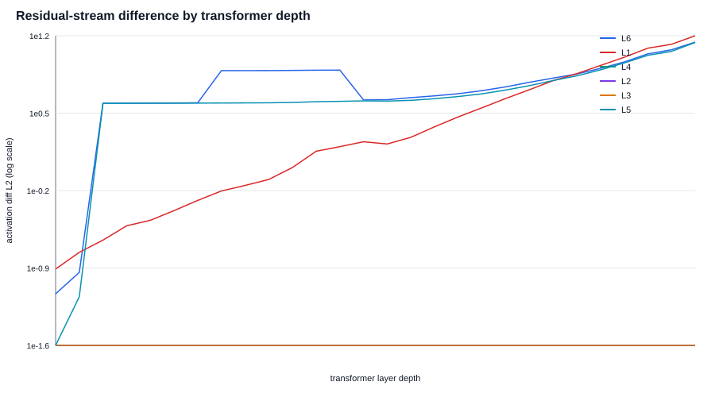

# Phase 1.5 Attribution Ladder

## Claim Scope
Execution-path mismatch is relevant only when the training algorithm's own discrete boundary amplifies it into an optimization-semantic fork. A fork is called fragile or bug only under a validated analytic legal bound; raw numerical mismatch alone is not a claim.

## Confound Checklist
- one_variable_changed_per_level: required by measurement run
- same_samples_and_tokens: required by measurement run
- activation_dump_compact: PASS
- large_tensor_outputs_avoided: PASS
- additive_percent_claim_disabled: PASS
- residual_stream_grouped_by_layer_index: PASS
- causal_local_injection_separated: FAIL

## Delta Self Control
Phase 1.5 consumes Phase 1 self-consistent path pairs.

The initial cold A4 locked-SDPA-MATH compile pair failed its self gate (`self_alt p99=1.56548e-3` versus `cross p50=4.38318e-5`). A dedicated three-pass audit localized this to cold-to-warm compile state: pass 1 to 2 changed 1,835 tokens, while pass 2 to 3 was bitwise equal. With one full discarded warm-up pass on both paths, the full 51,200-token rerun passed both self gates with p99 zero.

## External Validity
All probes run on T4 FP16. FP16 underestimates BF16 unit roundoff; a zero FP16 result cannot exclude a BF16 effect. Controlled interventions below characterize FP16 sensitivity and are not production-backend attribution.

## Summary
All six one-variable sensitivity measurements are present. Ratios are relative to L6 and are not additive attribution percentages.

## Attribution
| level | variable | mechanism | first_observed_diff_l2 | max_activation_diff_l2 | propagation_gain_first_to_last | final_logprob_delta | relative_to_composite_percent | additive_attribution_valid | propagation_exponent |
| --- | --- | --- | --- | --- | --- | --- | --- | --- | --- |
| L6 | torch.compile | mixed | 0.06877368502318859 | 14.740049123764038 | 214.3268768976695 | 0.003448342259448234 | 100.0 | False | 1.1266651047922214 |
| L1 | attention backend | algorithm_structure | 0.1167544536292553 | 16.901999473571777 | 144.76535111236754 | 0.0039224781924582786 | 113.74967730395505 | False | 1.606488221954465 |
| L4 | log_softmax precision | rounding_precision | 0.0 | 0.0 | None | 0.000254993909882123 | 7.394681000224274 | False | None |
| L2 | RMSNorm fused/unfused | materialization_points | 0.0 | 0.0 | None | 0.0 | 0.0 | False | None |
| L3 | intermediate materialization | materialization_points | 0.0 | 0.0 | None | 0.0 | 0.0 | False | None |
| L5 | low-precision matmul reduction precision | reduction_precision | 0.022897309623658657 | 14.636686086654663 | 639.2316969645769 | 0.003315849061261922 | 96.1577712356339 | False | 1.3122111692659406 |

L4 is a controlled direct-FP16-model probe, not a faithful model of the canonical FP32-master Trainer path. A standalone same-forward audit (`reports/phase2_logsoftmax_isolation.md`) showed that autocast promotes `log_softmax(half_logits)` to FP32 output; at step 5 the half-input versus explicit-float-input dispatch delta was at most `4.76837e-7` on target tokens. More importantly, the real Trainer canary (`reports/phase2_logsoftmax_online_smoke.md`) exposed FP32 logits on both sides and exact-zero cross delta over 512 tokens. Under P1, canonical L4 is a no-op and the original L4 value must not be used as a canonical training attribution term.

## Propagation Curves

<!-- phaseA4A5:start -->
## Phase A Attribution Repairs

### Canary controls

All revised switches passed a positive control on `path_alt`. L1/L2a/L2b/L3/L5 used a `1e-3` injection. L4 and L6 initially returned exact zero because FP16 quantized the L4 perturbation away and the L6 hook was outside the captured graph; after moving L6 to the compiled model output and using a representable `4e-3` perturbation, both passed. The failed attempts remain in `results/phase15_canaries.jsonl`; corrected rows are in `results/phase15_canaries_fix.jsonl`.

### P2 RMSNorm redesign

| probe | mean abs delta logp | max delta | interpretation |
| --- | --- | --- | --- |
| FP32-upcast vs FP16 no-upcast | 8.78545 | 15.0171 | catastrophic FP16 overflow/sensitivity; not a subtle legal backend difference |
| eager vs compiled RMSNorm submodules | 0.00322309 | 0.040525 | nonzero sensitivity, provisional until this compiled subpath gets an independent warm-state self audit |

The original “reference RMSNorm” L2 remains classified as a no-op and is not evidence.

### A5 corrected L3

FP16 to BF16 to FP16 round trips produced mean absolute logprob delta `0.0131554` and max `0.177577` over 512 tokens. This is strictly a controlled cross-format sensitivity probe. It does not identify materialization behavior of eager, compile, vLLM, or any other real backend.

### A4 locked-attention audit

Both paths were loaded with `attn_implementation=sdpa` and forced to SDPA-MATH; only eager versus compile differed. The cold run is retained as an invalid diagnostic because compile changed between its first and second full passes. The explicit warmed protocol discards one complete ordered pass before measuring two self runs; it produced cross mean `0.00201308`, p99 `0.0201359`, and ref/alt self p99 exactly zero over 51,200 tokens.

The warmed, attention-locked delta did not fall by an order of magnitude relative to the original compile pair (mean `0.00207561`, p99 `0.0215079`). Therefore compile retains a substantial independent component after attention is fixed, and the compile and eager-vs-SDPA claim pairs remain separate evidence. Cold-to-warm differences are reported as compile-state effects and are excluded from backend numerical attribution.
<!-- phaseA4A5:end -->
